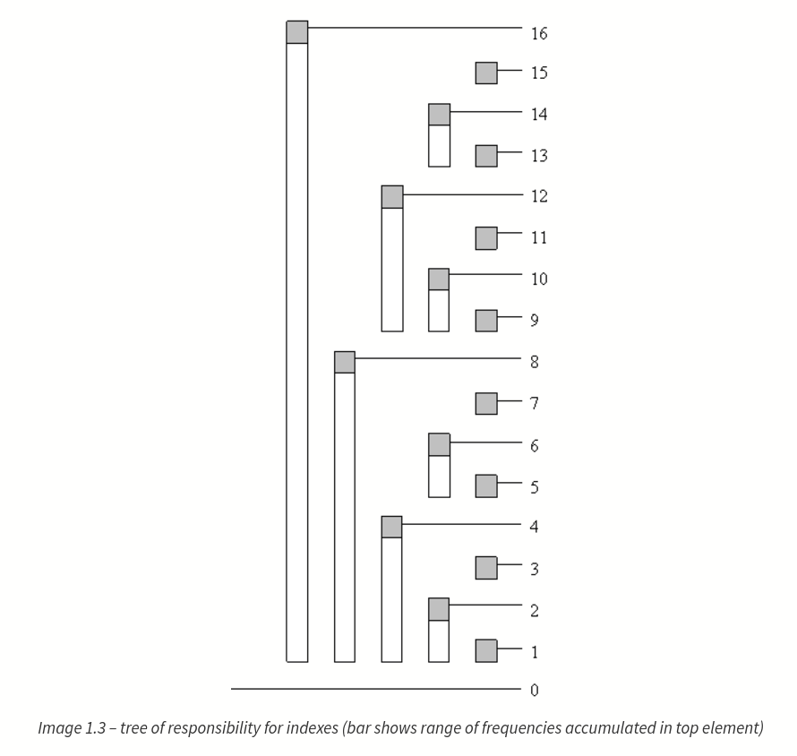

# Binary Index Tree (Fenwick Tree)

[topcoder tutorial](https://www.topcoder.com/community/data-science/data-science-tutorials/binary-indexed-trees/)
[wiki](https://en.wikipedia.org/wiki/Fenwick_tree)

tree[idx] is sum of frequencies from index (idx – 2^r + 1) to index idx. idx is some index of BIT. r is a position in idx of the last digit 1 (from left to right) in binary notation.



### Get cumulative sum from 1~idx

Suppose we are looking for cumulative frequency of index 13 (for the first 13 elements). In binary notation, 13 is equal to 1101. Accordingly, we will calculate c[1101] = tree[1101] + tree[1100] + tree[1000].

#### Get the last 1 of num

```java
(idx & -idx)
```

```java
int read(int idx){
    int sum = 0;
    while (idx > 0){
        sum += tree[idx];
        idx -= (idx & -idx);
    }
    return sum;
}
```

### Update the value of nums[idx]

```java
void update(int idx, int val){
    while (idx <= tree.length){
        tree[idx] += val;
        idx += (idx & -idx);
    }
}
```
