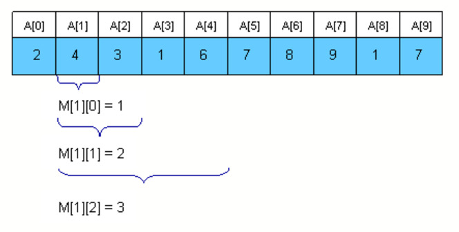
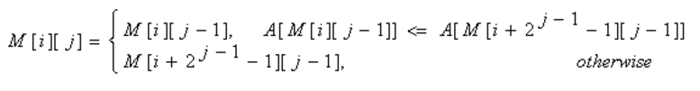
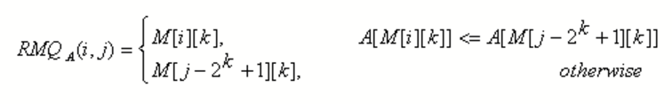

# Ranged Minimum Query

[topcoder](https://www.topcoder.com/community/data-science/data-science-tutorials/range-minimum-query-and-lowest-common-ancestor/)

## Sparse Table algorithm

M[i][j] is the index of the minimum value in the sub array starting at i having length 2j.





```c++
void process2(int M[MAXN][LOGMAXN], int A[MAXN], int N)
{
    int i, j;

    //initialize M for the intervals with length 1
    for (i = 0; i < N; i++)
        M[i][0] = i;
    //compute values from smaller to bigger intervals
    for (j = 1; 1 << j <= N; j++)
        for (i = 0; i + (1 << j) - 1 < N; i++)
            if (A[M[i][j - 1]] < A[M[i + (1 << (j - 1))][j - 1]])
                M[i][j] = M[i][j - 1];
            else
                M[i][j] = M[i + (1 << (j - 1))][j - 1];
}  
```

Let k = [log(j - i + 1)]



## Segment Tree

```c++
void initialize(intnode, int b, int e, int M[MAXIND], int A[MAXN], int N)
{
   if (b == e)
       M[node] = b;
   else
   {
       //compute the values in the left and right subtrees
       initialize(2 * node, b, (b + e) / 2, M, A, N);
       initialize(2 * node + 1, (b + e) / 2 + 1, e, M, A, N);
       //search for the minimum value in the first and
       //second half of the interval
       if (A[M[2 * node]] <= A[M[2 * node + 1]])
           M[node] = M[2 * node];
       else
           M[node] = M[2 * node + 1];
   }
}
```

```c++
int query(int node, int b, int e, int M[MAXIND], int A[MAXN], int i, int j)
{
   int p1, p2;

   //if the current interval doesn't intersect
   //the query interval return -1
   if (i > e || j < b)
       return -1;

   //if the current interval is included in
   //the query interval return M[node]
   if (b >= i && e <= j)
       return M[node];

   //compute the minimum position in the
   //left and right part of the interval
   p1 = query(2 * node, b, (b + e) / 2, M, A, i, j);
   p2 = query(2 * node + 1, (b + e) / 2 + 1, e, M, A, i, j);

   //return the position where the overall
   //minimum is
   if (p1 == -1)
       return M[node] = p2;
   if (p2 == -1)
       return M[node] = p1;
   if (A[p1] <= A[p2])
       return M[node] = p1;
   return M[node] = p2;
}
```
