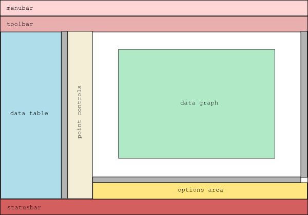

# Glade 3 tutorial(1) - Introduction

Original link: http://blog.borovsak.si/2009/09/glade3-tutorial-1-introduction.html  

Hello again. 

In next series of posts I'll try to show you some of the techniques I personally use when developing applications using Glade3. 

What are we going to code 

Our sample application will be simple, but fully functional graph viewer and editor. Things that I'll be demonstrating through this sample application are:

* How to approach to new project that will use Glade3 as GUI designer.
* How to use Glade3 to create visual elements of application.
* How to use Glade3 to create data storage objects for application.
* How to connect callback functions to widgets' signals.
* How to draw onto widgets using Cairo graphics library.
* How to use Pango from Cairo using pangocairo.
* How to create action-based menus and toolbar.

I may add other stuff to this list if interest/need arises. 

Who may be interested in this series of posts? 

I'll do my best to write this tutorial "newcomer to GTK+" friendly and try to explain almost everything I'll do. Experienced users may die from boredom when reading a section explaining some fundamental thing, so please, if youre GTK+ guru, read this series with caution;). 

Contents

* [Glade3 tutorial (1) - Introduction](./introduction.md)
* [Glade3 tutorial (2) - Constructing interface](./2_constructing_interface.md)
* [Glade3 tutorial (3) - Size negotiation]()
* [Glade3 tutorial (4) - GtkTreeView data backend]()
* [Glade3 tutorial (5) - Modifying widget tree]()
* [Glade3 tutorial (6) - Signals]()

First steps 

OK, since it looks like you gave me a chance to show how I usually work, let's start. 

Today's work will be separated into two sections:

1. Creating "blueprint" of our application's GUI based on requirements.
2. Writing down widget tree, based on blueprint from previous section.

Now, what are requirements for our application. Obviously, it needs to be able to display data in numeric and graphic form. We also want to be able to add new, delete, rearrange and modify points. We also want to be able to display point markers, connecting lines or both on the chart. And this is about it for initial requirements. We'll leave some space for future expansion in our plans, just in case if we decide to add anything to it later. 

Now comes the fun part - drawing interface. I prefer to do this on paper using pencil, but feel free to experiment. For sample project, I came up with this design: 



Dark gray rectangles represent scroll bars. What do you think? Do I suck as interface designer or do I really suck as interface designer?;) 

Now for the last thing we need to do today: writing down widget tree. In GTK+, everything starts with top-level [GtkWindow](http://library.gnome.org/devel/gtk/stable/GtkWindow.html), which will serve as a root of our widget tree. 

Our main window will be split into four vertical sections: one for menu bar, one for tool bar, one for central part where all the action will happen and last one for status bar. Since our main window (GtkWindow) can hold only one child widget, we need [GtkVBox](http://library.gnome.org/devel/gtk/stable/GtkVBox.html) in which we will pack, from bottom to top: [GtkStatusbar](http://library.gnome.org/devel/gtk/stable/GtkStatusbar.html), widget for central part, [GtkToolbar](http://library.gnome.org/devel/gtk/stable/GtkToolbar.html) and [GtkMenuBar](http://library.gnome.org/devel/gtk/stable/GtkMenuBar.html). Why did I say that we'll be packing from bottom? I'll explain this in next post, when we'll be playing with Glade3. 

Central part will need to be further divided into horizontal sections: one for data table, one for point controls and one for display area. So this will require [GtkHBox](http://library.gnome.org/devel/gtk/stable/GtkHBox.html). What widgets will we need inside it? For data table we'll use [GtkTreeView](http://library.gnome.org/devel/gtk/stable/GtkTreeView.html), which is packed inside [GtkScrolledWindow](http://library.gnome.org/devel/gtk/stable/GtkScrolledWindow.html) to enable scrolling. For point controls we'll need [GtkVButtonBox](http://library.gnome.org/devel/gtk/stable/GtkVButtonBox.html) that will house our buttons. 

Now for the display area. We again have two parts: upper part that will actually display chart; and bottom part that will hold check buttons. So we'll need another GtkVBox to hold the whole section. Bottom part will be represented by [GtkHButtonBox](http://library.gnome.org/devel/gtk/stable/GtkHButtonBox.html) with GtkToggleButtons, while upper part deserves another paragraph;). 

Why another paragraph? Because we'll need to add quite a few widgets in order to get desired layout. As you can see on my drawing, I want to have graph area centered in display part. In order to be able to add zoom to chart area, we also need some kind of scrolling widget. And how to assemble all this together? First we'll add GtkScrolledWindow to GtkVBox from previous paragraph. To make contents scrollable, we need to pack [GtkViewport](http://library.gnome.org/devel/gtk/stable/GtkViewport.html) inside GtkScrolledWindow. Inside GtkViewport we'll add [GtkAlignment](http://library.gnome.org/devel/gtk/stable/GtkAlignment.html), which will take care of centering the chart area. Inside GtkAlignment we'll add [GtkFrame](http://library.gnome.org/devel/gtk/stable/GtkFrame.html), which will add a shadow to chart area. Finally, we add GtkDrawing area inside GtkFrame. And we're done. 

If we convert this verbose description into tree-like representation, we get this:

```text
GtkWindow
 `- GtkVBox
     +- GtkMenuBar
     |   `- /* Menus here */
     +- GtkToolbar
     |   `- /* Tool buttons here */
     +- GtkHBox
     |   +- GtkScrolledWindow
     |   |   `- GtkTreeView
     |   +- GtkVButtonBox
     |   |   `- /* Buttons here */
     |   +- GtkVBox
     |       +- GtkScrolledWindow
     |       |   `- GtkViewport
     |       |       `- GtkAlignment
     |       |           `- GtkFrame
     |       |               `- GtkDrawingArea
     |       `- GtkHButtonBox
     |           `- /* Check buttons here */
     `- GtkStatusBar
```

There is just one thing I would like to explain today. When adding GtkTreeView to GtkScrolledWindow I haven't used GtkViewport as an adapter widget, while adding GtkAlignment did require one. Why? When it comes to GtkScrolledWindow, there are two kinds of widgets: the ones that support scrolling natively and the ones that don't. GtkTreeView, GtkTextView, GtkIconView and GtkViewport do support scrolling and can be added into GtkScrolledWindow directly. All other widgets need GtkViewport as an adapter. 

I hope this starting lesson wasn't too tough and you'll join me next time when we'll fire up Glade3 and do some property mangling. 

Stay healthy. 

Bye.