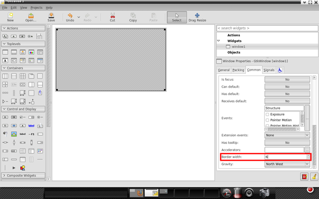
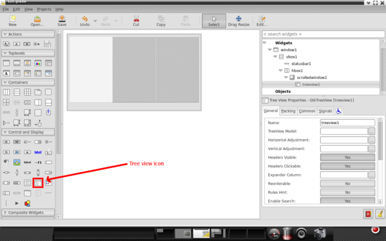
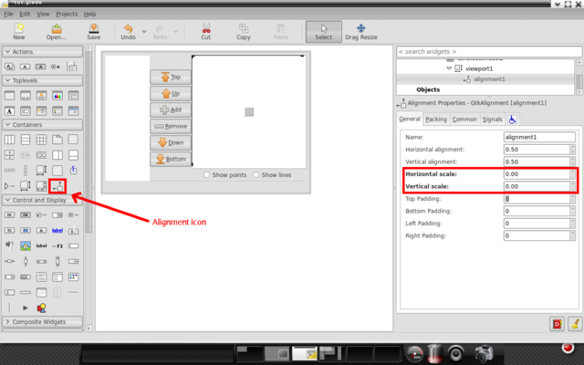

# Glade3 tutorial (2) - Constructing interface

Original link: http://blog.borovsak.si/2009/09/glade3-tutorial-2-constructing.html

Welcome back. 

In this part of tutorial, we'll create application's GUI using Glade3 according to our blueprint and widget tree. To check how our GUI looks like, we'll also write a minimalistic application. 

I'll be using Glade3-3.6.7 in this tutorial, but any version from 3.6 series will do. Our project will be saved as a GtkBuilder project and we'll use GtkBuilder to create our interface at runtime. Glade3-3.4.5 cannot be used when following this tutorial, since we'll use some new features of Glade3 that were introduced in 3.6 series. 

Contents

* [Glade3 tutorial (1) - Introduction](./1_introduction.md)
* [Glade3 tutorial (2) - Constructing interface](./2_constructing_interface.md)
* [Glade3 tutorial (3) - Size negotiation]()
* [Glade3 tutorial (4) - GtkTreeView data backend]()
* [Glade3 tutorial (5) - Modifying widget tree]()
* [Glade3 tutorial (6) - Signals]()

Constructing interface 

I tried to document each step in GUI creation with screenshot and instructions. Video of the actual process can be found on [ScreenToaster site](http://www.screentoaster.com/watch/stU0tWQk1IR1xdQ1xYUlJZVVFT/glade3_tutorial_creating_gui). 

When you start Glade3 without opening project, you're greeted by two windows: main application window that we'll be using to create interface and preferences dialog that lets you set some project settings. 


You can see from this screen that we'll be using GtkBuilder project format with object names being unique across the whole project. We won't be using any images in this project, so resource location is not important to us. Lastly, this project will be compatible with GTK+ >= 2.14, which should make it usable on most distributions out there. You can check your project for any incompatibilities from this dialog too, but since we're starting new poject, this is not needed. Last thing is to click Close and we're done with initial setup. 

Now it's time to place initial toplevel window into project. Just click "Window" icon in "Toplevels" category and you should see something like this: 


Now we need to switch to "Common" tab in properties section and set "Border width" to 6 px. 



Last thing we need to do with main window is to connect `gtk_main_quit` function to "destroy" signal. This will close our application when we'll click on close button. I'll talk more about signals in one of the following posts, so no more details will be given here. 

> Quote by FatMinMin:
> In GTK 3, the destroy signal is in GtkWidget


With our main window finished, we need to add GtkVBox to it. In previous post, we planed to add four widgets inside this box, but since menu bar and tool bar will be created using GtkUIManager and manually inserted from code, we only need two. So when we're asked about number of elements, we enter 2. 


Now we'll add status bar to application. Click status bar icon and insert it into bottom of the box. Your GUI should look something like this: 


Now we need to make sure that status bar is packed from bottom to top. Why is this important? If we would to pack status bar from top to bottom, it would be impossible to add menu and tool bar at the top of the application. How to ensure that status bar is packed from bottom to top? Select "Packing tab" and select "End" as pack type and set "Position" to 0. What does this do? It instructs Glade to pack status bar as first element from bottom to top. 
 
 

Next is horizontal box that will hold three widgets. Creating one is exactly the same as creating vertical box. Don't forget to adjust pack type of this box to "End" too!!! 

> Quote by FatMinMin:
> In GTK 3, There is no GtkVBox and GtkHBox. Only GtkBox available. You can change the orientation property to be horizontal or vertical.

 

According to our widget tree, we need to insert scrolled window into first compartment. And since we only want to have vertical scrollbar present when needed, we need to adjust horizontal scrollbar policy too. 

 

Inserting tree view into scrolled window is easy. Click tree view icon and insert it into scrolled window. When asked about TreeView model, just leave field empty and click OK (we'll be dealing with this when we'll add data storage to our application). 

 

Inside second field of horizontal box goes vertical button box that will hold buttons for modifying data inside tree view. We'll need six buttons inside this box: "move to top", "move up", "add", "remove", "mode down" and "move to bottom". So when we're asked about number of fields when creating vertical button box, we enter 6 and click OK. Next, we need to modify some of the properties of the button box. We'll set "Layout style" to "Center", "Spacing" to 2 and "Homogeneous" to "Yes". 

 

Under "Packing" tab, we set the "Expand" property to "No", since we want buttons to take as little space as possible. 

 

Creating buttons is simple. Just click button icon and place it onto proper space. Now under "General" tab search for "Stock button" and set it to "Top" (Glade will convert icon you select to stock item name automatically, so don't worry about what is written in Stock Button field). 

 

Using exactly the same steps create another five buttons. Icons for them should be "Up", "Add", "Remove", "Down" and "Bottom". 

 

Last empty field in horizontal box should be, according to our widget tree, filled with vertical box that will house two children widgets. End result should look something like this: 

 

Inside bottom compartment, we need to add horizontal button box for two toggle buttons. We'll also set "Layout style" to "Center", "Spacing" to 2 and "Homogeneous" to "Yes". 

 

Under packing, set "Expand" property to "No", since we want this section to take as little space as possible. 

 

Adding buttons to this box is very similar to adding them to vertical box. But we'll add check buttons here instead of normal ones. Simply click Check button icon and insert it into empty space inside button box. After that, change the button's label to "Show points". Repeat those steps to create second check button and change label to "Show lines".

 

Upper part of the vertical box will house scrolled window. Add it exactly the same as we added the one for data part. Inside this scrolled window we need to insert viewport. 

 

Next in widget tree is alignment which will take care of centering the drawing area. Creating one is simple: just click Alignment icon and insert it into viewport. We also need to modify horizontal and vertical scale values. Those two control the expansion of the child widget. Value 1 means "Expand child as much as possible", 0 means "Do not expand child at all" while 0.4 means "Expand child to take 40% of allocated size". We'll set both values to 0, since we want our child to be constant in size. 

 

Inserting frame takes some work in our case, since Glade3 does some things by default that we don't need. Click frame icon and insert it into alignment. Change "Frame shadow" to "In" and you should end up with something like this: 

 

You can see that Glade automatically added label and alignment into frame. We don't need any, so we'll delete them both. This is how things look after removal: 

 

And we are left with only one widget to pack: drawing area. Click icon and insert it into bottom compartment of frame (upper one will be left empty, since we don't want any label). Under "Common", set widget's size request to 300 x 200 px and we're done. 

 

There is only one thing left to do for today: save and test this GUI. We'll write really simple C application for this task. I won't explain much about code today, since we'll be dealing with coding in later posts, but most of the code should be easy to understand.

```c
/*
 * Compile me with:
 *   gcc -o tut tut.c $(pkg-config --cflags --libs gtk+-2.0 gmodule-2.0)
 */

#include <gtk/gtk.h>

int
main( int    argc,
      char **argv )
{
    GtkBuilder *builder;
    GtkWidget  *window;
    GError     *error = NULL;

    /* Init GTK+ */
    gtk_init( &argc, &argv );

    /* Create new GtkBuilder object */
    builder = gtk_builder_new();
    /* Load UI from file. If error occurs, report it and quit application.
     * Replace "tut.glade" with your saved project. */
    if( ! gtk_builder_add_from_file( builder, "tut.glade", &error ) )
    {
        g_warning( "%s", error->message );
        g_free( error );
        return( 1 );
    }

    /* Get main window pointer from UI */
    window = GTK_WIDGET( gtk_builder_get_object( builder, "window1" ) );

    /* Connect signals */
    gtk_builder_connect_signals( builder, NULL );

    /* Destroy builder, since we don't need it anymore */
    g_object_unref( G_OBJECT( builder ) );

    /* Show window. All other widgets are automatically shown by GtkBuilder */
    gtk_widget_show( window );

    /* Start main loop */
    gtk_main();

    return( 0 );
}
```

Now run this code and be amazed;). Not too bad, but nothing special either. Try resizing window to see how compartments behave when resized. Do you like it? I don't either, so join me next time when we'll be dealing with space alocation/requisition in detail. 

And we're done. If you need more detailed process of clicking/changing properties, head to ScreenToaster site, where you can watch video of the whole thing. Hope you'll find it useful. 

Finished glade file can be obtained from here: [tut.glade](http://tadeboro.googlepages.com/tut.glade). 

Stay healthy.

> Edit by FatMinMin
> My [tut.glade](./tut.glade) and [tut.py](./tut.py) using GTK 3 and PyGI

```python
# tut.py

import gi
gi.require_version('Gtk', '3.0')
from gi.repository import Gtk

builder = Gtk.Builder()
builder.add_from_file("./tut.glade")
builder.connect_signals({"onDeleteWindow": Gtk.main_quit,})

window = builder.get_object("window1")
window.show_all()

Gtk.main()
```
